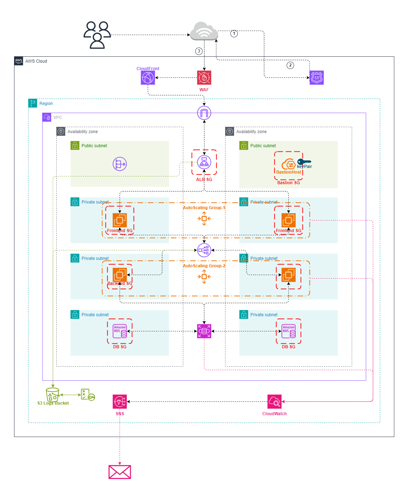

# Scalable Web Application with ALB and Auto Scaling
This repository contains the code to provision a **secure, resilient, and production-grade AWS infrastructure** using **Terraform**. The architecture follows the **3-tier design pattern**—consisting of a presentation layer (frontend), an application layer (backend), and a data layer (RDS MySQL)—all deployed across **multiple availability zones (AZs)** for high availability.

The infrastructure integrates core AWS services including **Auto Scaling Groups**, **Elastic Load Balancers (ALB/NLB)**, **CloudFront with WAF**, **Route 53**, **RDS with Multi-AZ**, **CloudWatch**, and **SNS alerting**, all wrapped with secure networking and logging best practices.

This project is ideal for DevOps engineers, Cloud architects, or learners looking to understand full-stack AWS provisioning using Infrastructure as Code (IaC).

## 🏗️ Architecture Overview

The architecture deployed by this Terraform code looks like the following:

- Users access the application via **CloudFront**, which serves as a CDN and entry point protected by **AWS WAF**.
- CloudFront forwards traffic to the **Application Load Balancer (ALB)**, which distributes requests to a scalable group of **frontend EC2 instances**.
- The frontend communicates with the **backend service** through an internal **Network Load Balancer (NLB)**.
- Backend services interact securely with a **MySQL RDS database** deployed in Multi-AZ mode.
- A **Bastion Host** in the public subnet allows SSH access to internal resources for maintenance.
- **CloudWatch** monitors CPU usage, triggering **Auto Scaling Policies** and **SNS alerts**.
- **S3** stores access logs from ALB/NLB to enable auditing and operational insights.

## ☁️ AWS Services Used

| AWS Service              | Purpose                                                                 |
|--------------------------|-------------------------------------------------------------------------|
| **VPC, Subnets, IGW/NAT**| Custom networking across 2 Availability Zones                          |
| **EC2**                  | Bastion host, Frontend & Backend servers (via ASGs)                     |
| **Auto Scaling**         | Dynamically scales frontend and backend instances                      |
| **ALB / NLB**            | Load balancers for frontend (internet-facing) and backend (internal)    |
| **CloudFront**           | CDN and global entry point for the application                         |
| **AWS WAFv2**            | Protects the application at the CloudFront edge                         |
| **RDS (MySQL)**          | Highly available database with Multi-AZ support                         |
| **S3**                   | Stores ALB and NLB access logs                                          |
| **IAM**                  | Granular permissions and roles for secure service access               |
| **Route 53**             | DNS for the application domain                                          |
| **CloudWatch**           | CPU monitoring and alerting                                             |
| **SNS**                  | Email alerts on resource metrics                                        |

## 🎯 Project Goals & Learning Outcomes

This project is designed to demonstrate:

- ✅ **Modular infrastructure provisioning** using Terraform
- ✅ **High availability and fault tolerance** with Multi-AZ deployment
- ✅ **Secure networking** using security groups, WAF, and NAT Gateway
- ✅ **Horizontal scalability** through Auto Scaling Groups and metrics-based scaling policies
- ✅ **Logging and observability** with S3 access logs and CloudWatch metrics
- ✅ **Cloud best practices** for deployment, DNS, CDN, and RBAC

Upon completion, you will be confident in designing, provisioning, and managing cloud infrastructure using Terraform for real-world production-grade workloads.

## 🔧 Input Variables

| Name                   | Description                                            | Type     | Required |
|------------------------|--------------------------------------------------------|----------|----------|
| `region`               | AWS region for resource deployment                     | `string` | ❌ (Default: `"us-east-1"`) |
| `env`                  | Environment identifier (e.g., `dev`, `prod`)           | `string` | ✅        |
| `cidr`                 | CIDR block for VPC                                     | `string` | ✅        |
| `bastion_instance_type`| EC2 instance type for Bastion Host                     | `string` | ❌ (Default: `"t2.micro"`) |
| `frontend_instance_type`| EC2 instance type for frontend ASG                    | `string` | ❌ (Default: `"t2.micro"`) |
| `backend_instance_type`| EC2 instance type for backend ASG                      | `string` | ❌ (Default: `"t2.micro"`) |
| `db_instance_type`     | RDS DB instance class                                  | `string` | ❌ (Default: `"db.t3.micro"`) |
| `db_username`          | RDS MySQL username                                     | `string` | ✅        |
| `db_password`          | RDS MySQL password                                     | `string` | ✅        |
| `public_key`           | Path to SSH public key for Bastion Host                | `string` | ❌ (Default: `"~/.ssh.id_rsa.pub"`) |
| `frontend_script`      | Path to User Data script for frontend EC2              | `string` | ❌ (Default: `"./frontend"`) |
| `backend_script`       | Path to User Data script for backend EC2               | `string` | ❌ (Default: `"./backend"`) |
| `my_public_ip`         | Your IP for SSH access (e.g., `1.2.3.4/32`)            | `string` | ✅        |
| `logs_bucket_name`     | Name of S3 bucket for storing logs                     | `string` | ✅        |
| `sns_email`            | Email for SNS alert subscription                       | `string` | ✅        |
| `domain_name`          | Domain name (e.g., `example.com`) for Route53 setup    | `string` | ✅        |

## 📤 Output Variables

| Output Name               | Description                                                  |
|---------------------------|--------------------------------------------------------------|
| `alb_dns_name`            | DNS name of the ALB                                          |
| `nlb_dns_name`            | DNS name of the NLB                                          |
| `cloudfront_domain_name` | CloudFront distribution domain                                |
| `bastion_public_ip`       | Public IP of the Bastion Host                                |
| `rds_endpoint`            | Endpoint to connect to the MySQL database                    |
| `s3_logs_bucket`          | S3 bucket name used for logging                              |
| `route53_zone_id`         | Route53 Hosted Zone ID for the domain                        |

## 🚀 How to Deploy

> 💡 Make sure you have [Terraform](https://developer.hashicorp.com/terraform/install) and AWS CLI installed and configured.

1. **Clone the repository**

   ```bash
   git clone https://github.com/manara-projects/project-1.git
   cd project-1/terraform/
   ```

2. **Configure your terraform.tfvars**

    Example:

    ```hcl
    region           = "us-east-1"
    env              = "dev"
    cidr             = "10.0.0.0/16"
    db_username      = "admin"
    db_password      = "StrongPassword123!"
    public_key       = "path/to/public-key.pub"
    my_public_ip     = "YOUR_PUBLIC_IP/32"
    sns_email        = "your.email@example.com"
    domain_name      = "yourdomain.com"
    logs_bucket_name = "your-logs-bucket"
    ```

3. Initialize Terraform

    ```bash
    terraform init
    
    ```
    
4. Review and deploy the infrastructure

    ```bash
    terraform plan
    terraform apply
    ```
    
5. Confirm SNS subscription

    Check your inbox and confirm the email subscription to receive CloudWatch alerts.

## 🙏 Acknowledgements

Designed and built by [Ahmed Elhgawy](https://www.linkedin.com/in/ahmed-elhgawy-a16310268/) as part of a personal initiative to master AWS infrastructure and DevOps practices.

Inspired by AWS Well-Architected Framework and real-world DevOps use cases.

## 📬 Contact & Connect

If you’d like to connect, collaborate, or ask questions about this project or AWS DevOps in general, feel free to reach out!

- 💼 **LinkedIn:** [Ahmed Elhgawy](https://www.linkedin.com/in/ahmed-elhgawy-a16310268/)
- 💻 **GitHub:** [github.com](https://github.com/Ahmed-Elhgawy)
- 📧 **Email:** [ahmedelhgawy182@gmail.com](mailto:ahmedelhgawy182@gmail.com)

I’m always open to networking, feedback, or exciting DevOps opportunities!